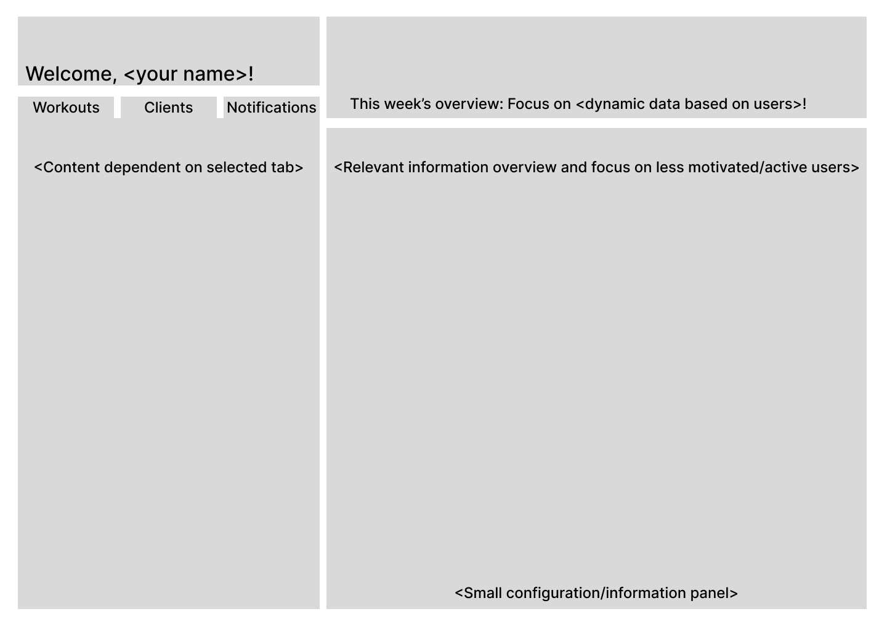

# xtracise
## by Aaron Kieran Southcombe

Initial landing page sketch:

Logo photo taken from [here](https://www.publicdomainpictures.net/en/view-image.php?image=487289&picture=fitness-and-gym-logo)

### Usage

To use the app, all you have to do is sign in with your credentials, and you can edit, create, delete or modify any of your users' workouts!

You can also log out. You can only modify the workouts of users who you instruct.

### Development issues

For efficiency, I tried using the date column to display the exercises, but it seems to not account for time, so as seen in the code, it has been changed to use IDs.

Also, to minimize code footprint, the workout modification has been done via delete + create, seeing as the timestamp would be updated anyway. Thanks to this improvement, DataAccess only had to be modified to have delete functionality.

The minimal objective of this project has lead to a very reduced code footprint, achieving as much as possible in as simple and uncomplicated code achievable. This has lead to easily readable and understandable code.
